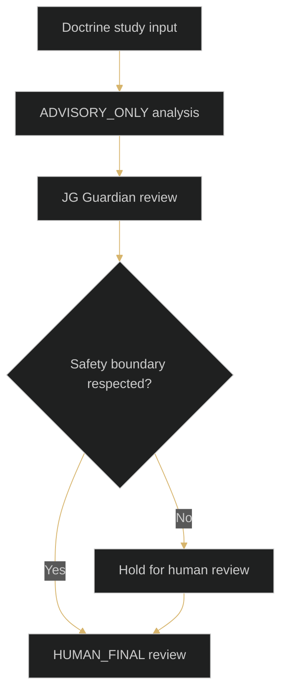
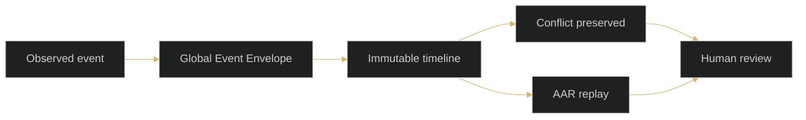
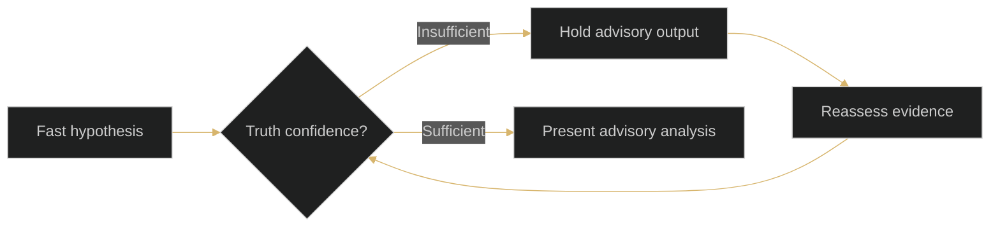
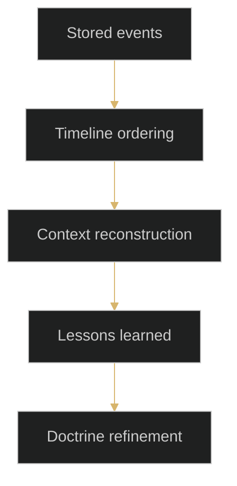

> **Scope:** Educational documentation only. SIMULATION_ONLY / ADVISORY_ONLY / HUMAN_FINAL.

# Conceptual Diagrams

These diagrams are educational and conceptual. They describe doctrine relationships for simulation study only.

Use the [Glossary](glossary.md) for confirmed term boundaries and cross-links back into the doctrine pages.

:::tip Key Takeaways
- JD, JM, JB, JG, and HUMAN are presented as conceptual learning layers.
- Guardian review is shown as a doctrine boundary, not an operational control system.
- Timeline and AAR diagrams describe preservation and review concepts for study.
:::

## Architecture Overview

Related Doctrine: [Part II - Agent Architecture](parts/02-part-ii.md), [Glossary: JD](glossary.md#jd), [Glossary: JG](glossary.md#jg).

## Doctrine Boundary Flow

Related Doctrine: [Part IV - Guardian Doctrine](parts/04-part-iv.md), [Glossary: ADVISORY_ONLY](glossary.md#advisory_only).

## Event Timeline Conceptual Flow

Related Doctrine: [Part III - Event Truth](parts/03-part-iii.md), [Glossary: Immutable Timeline](glossary.md#immutable-timeline).

## Truth Greater Than Speed

Related Doctrine: [Part I - Foundations](parts/01-part-i.md).

## AAR Replay Flow

Related Doctrine: [Appendix - Reference and AAR](parts/22-the-master-tactical-technical-manual.md), [Glossary: AAR](glossary.md#aar).

:::info Recommended Next Reading
Continue with [Part II - Agent Architecture](parts/02-part-ii.md), then move to [Part III - Event Truth](parts/03-part-iii.md) and [Part IV - Guardian Doctrine](parts/04-part-iv.md).
:::
