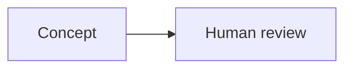

> **Scope:** Educational documentation only. SIMULATION_ONLY / ADVISORY_ONLY / HUMAN_FINAL.

# Documentation Maintenance Guide

This guide explains how to maintain the documentation site without changing doctrine meaning or adding operational features.

## Add New Markdown Pages

1. Add the new Markdown file under `docs/` or `docs/parts/`.
2. Include frontmatter:

```md
---
title: "Page Title"
sidebar_label: "Sidebar Label"
pagination_label: "Pagination Label"
description: "Short factual description."
tags:
  - j-trinity
  - reference
---
> **Scope:** Educational documentation only. SIMULATION_ONLY / ADVISORY_ONLY / HUMAN_FINAL.
```

3. Keep source doctrine wording intact.
4. Run `npm run build`.

## Update Sidebar Navigation

Edit `sidebars.js`.

- Preserve the doctrine order from `docs/parts`.
- Use professional textbook labels.
- Keep preface pages only when they preserve source structure.
- Place learning support pages such as diagrams, glossary, and maintenance after doctrine sections.

## Add Mermaid Diagrams

Add conceptual diagrams in `docs/diagrams.md` or a clearly named companion page.

````md

````

Diagram rules:

- Keep diagrams educational and conceptual.
- Do not turn advisory doctrine into command workflows.
- Link diagrams back to related doctrine pages.
- Preserve SIMULATION_ONLY / ADVISORY_ONLY / HUMAN_FINAL boundaries.

## Preserve Doctrine Boundaries

Every doctrine or learning page must preserve these constraints:

- SIMULATION_ONLY
- ADVISORY_ONLY
- HUMAN_FINAL
- No backend
- No Firebase
- No login
- No operational dashboard
- No command workflow
- No real-world control features

## Pre-Deploy Checklist

- Run `npm run build`.
- Verify SIMULATION_ONLY / ADVISORY_ONLY / HUMAN_FINAL notices are visible on doctrine and learning pages.
- Verify no backend, Firebase, login, operational dashboard, command workflow, or real-world control feature has been added.
- Verify `docusaurus.config.js` has the correct `url` and `baseUrl`.
- Verify `.github/workflows/deploy.yml` uploads the `build/` folder.
- Verify sidebar order still preserves the doctrine structure.

## Recommended Next Reading

- [Conceptual Diagrams](diagrams.md)
- [Glossary](glossary.md)
- [J-TRINITY C4ISR](parts/00-j-trinity-c4isr.md)
